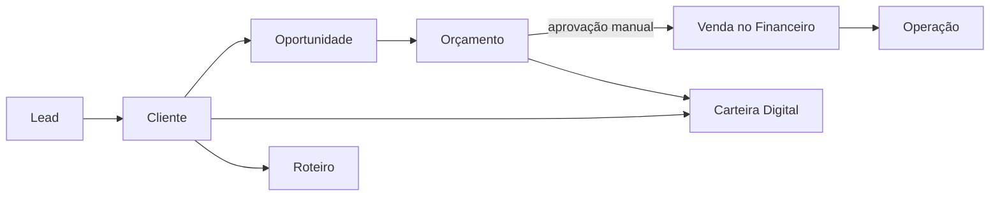
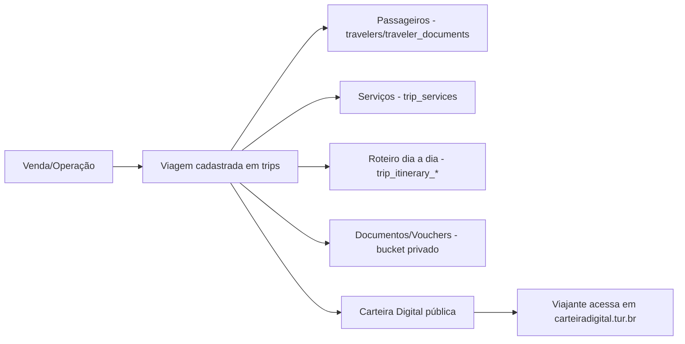
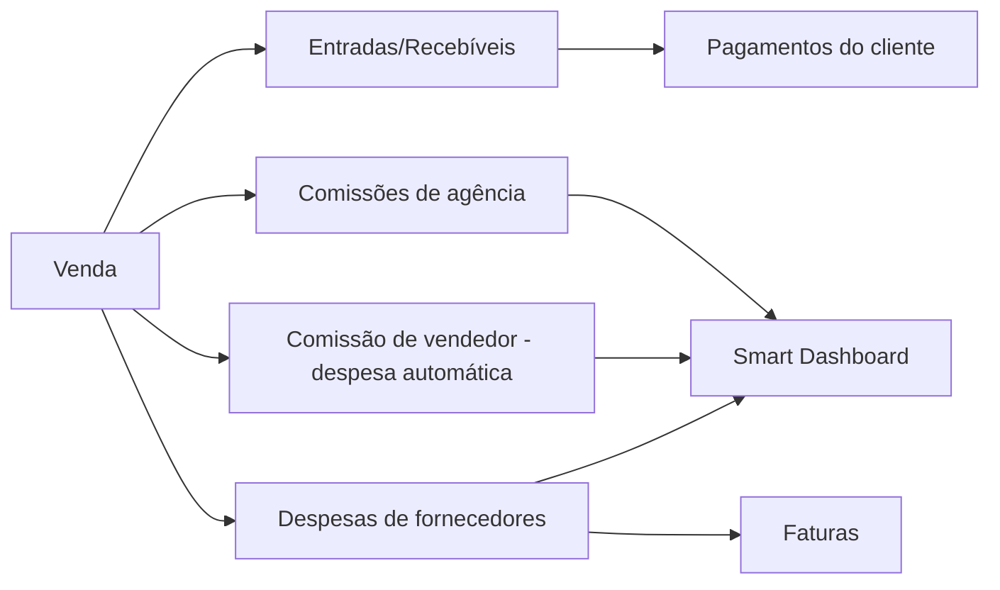
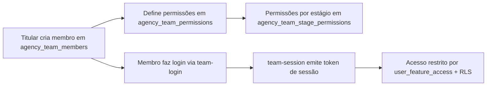

# 03 — Jornadas e fluxos

[← Índice](./00-LEIA-ME-E-INDICE.md)

## 1. Jornada comercial — lead até venda

**CONFIRMADO parcialmente**. As etapas existem como módulos, mas a passagem automática entre elas é, em geral, manual.

```text
Lead → Cliente → Oportunidade (Kanban) → Orçamento → Aprovação cliente → Venda (Financeiro) → Operação → Carteira/Roteiro
```

Detalhes verificados:

- **Lead** chega via Captação de Leads (formulários, landings, captação conversacional, OCR de cartão).
- **Cliente** precisa estar cadastrado antes de criar orçamento, roteiro ou carteira (ver `ClientSelector`).
- **Oportunidade** mora em `opportunities` com estágios `pipeline_stages`. Kanban em `CRM.tsx`.
- **Orçamento** (`quotes`, `quote_services`) gera link público em `seuorcamento.tur.br`.
- **Aprovação** é registrada no orçamento; **PENDENTE** confirmar se gera venda automática.
- **Venda** (`sales`, `sale_products`) é cadastrada no Financeiro. **INFERIDO**: a importação a partir do orçamento existe via UI mas a automação direta orçamento→venda não foi confirmada.
- **Operação** (`operations`) é o acompanhamento pós-venda.
- **Carteira/Roteiro** é gerado a partir do cliente e geralmente referenciado pelo orçamento.



## 2. Jornada da viagem

**CONFIRMADO**.



- Roteiro é híbrido em três camadas (Auto / IA / Manual) com coluna de origem.
- Vouchers são privados; acesso via `serve-voucher` (proxy) ou `get-secure-voucher` (signed URL).
- Reminders chegam via `trip_reminders` e popups.

## 3. Jornada financeira

**CONFIRMADO**.



- Lucro líquido = comissões da agência − (despesas + comissões de vendedores).
- Exportações XLSX/PDF respeitam filtros ativos.
- Datas de recebimento são calculadas por trigger conforme configuração.

## 4. Jornada da equipe

**CONFIRMADO**.



## 5. Jornada de conteúdo e suporte

**CONFIRMADO**.

- Usuário acessa **EducaTravel Academy** (trilhas) ou **Cursos e Mentorias** (marketplace, com Stripe).
- **Notícias do Trade** alimenta o Radar do Turismo (tabelas `news`, `noticias_brutas`, `noticias_dashboard`).
- **Suporte** abre ticket em `support_tickets`; respostas em tempo real via Realtime; anexos em bucket privado.
- **WhatsApp Support Button** disponível na maior parte das telas autenticadas (`WhatsAppSupportButton`).

## 6. Jornada do viajante (cliente final)

**CONFIRMADO**. O viajante acessa apenas conteúdo público:

- Carteira Digital (`carteiradigital.tur.br` + protegida por senha quando configurada).
- Roteiro (`seuroteiro.tur.br`).
- Orçamento (`seuorcamento.tur.br`).
- Fatura (`/fatura/:agencySlug/:code`).
- Cartão de visitas (`contato.tur.br`).
- Formulários de captação e pesquisas.

## 7. Jornada do fornecedor

**CONFIRMADO**. Cadastro em `/cadastro-fornecedor` ou `/cadastro-guia` → conta criada com perfil Fornecedor → acesso restrito a `/dashboard-fornecedor` e `/meu-perfil-empresa` (somente o próprio cadastro em `tour_operators`/`tour_guides`).